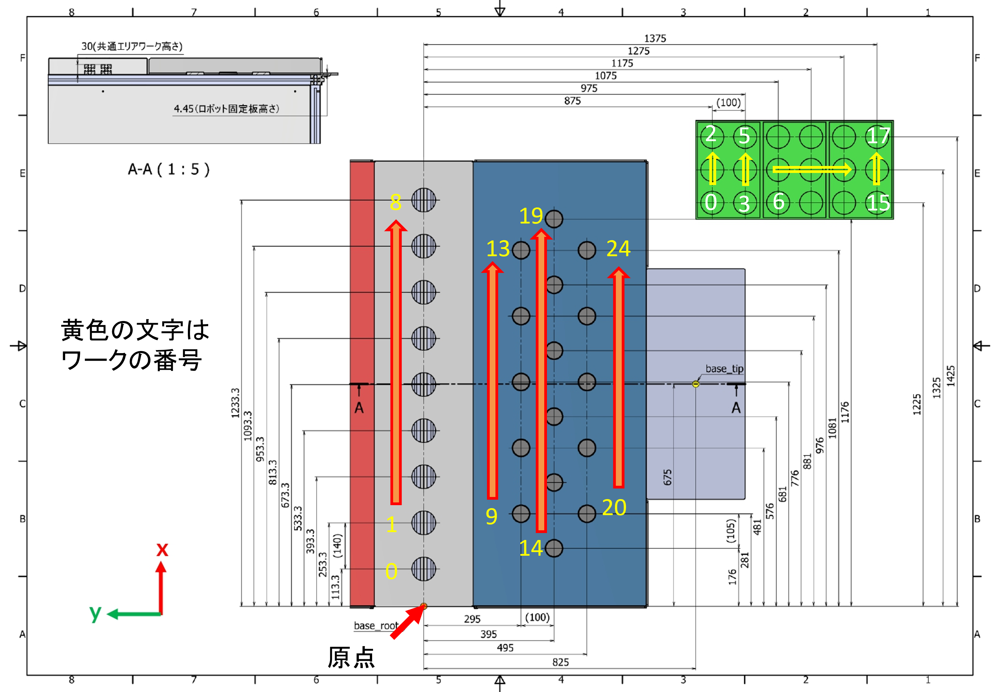

# Catchrobo 2021 ROS Package

## Environment
- ubuntu 20
- ros noetic

## Requirement
- sudo apt install ros-noetic-rosserial-mbed
- jsk-plugin
- joy con系
- pip install numpy pandas
- sudo apt install ros-noetic-sound-play 


### mbedへの反映
https://os.mbed.com/teams/catchrobo2022/
を使用する。

1. catchrobo_sim/include/catchrobo_simをzip化する
1. mbed compilerでプログラム名を選択し右クリック
1. インポートを選択
1. アップロードタブを選択
1. 下にあるChoose Fileから作成したzipを選択
1. ライブラリとしてインポートする(古いものがある場合には、削除してからインポートする)

- msgが変化した場合
``` 
rosrun rosserial_mbed make_libraries.py <コードの生成場所。どこでもいい>
```
作成後、round関数がmbedにないらしいので ros_lib/ros/duration.h　およびros_lib/ros/time.h　のclassの中に
```
 double round(double number) { return number < 0.0 ? ceil(number - 0.5): floor(number + 0.5); };
```
を追加する。

MbedHardware.hに
```
    #ifdef USE_XBEE
    :iostream(p13, p14)      //Xbee
    #else
    :iostream(USBTX, USBRX) //有線
    #endif
```
ros/node_handle.h
```
         int INPUT_SIZE = 1024,
         int OUTPUT_SIZE = 1024>
```

作成したros_libを上記の方法でインポートする。


注意事項：ノイズにより値がぶっ飛ぶことがある。原点出しはかなり近くから行う。
motorの電源を入れてからmbedを開始→rosserial開始
の流れにすることで、初期値をほぼ0とできる。


## How to use
### show robot
```
roslaunch catchrobo_description catchrobo_display.launch gui:=True field:=red
roslaunch catchrobo_bringup rviz.launch


```
### simulation
```
roslaunch catchrobo_bringup sim_bringup.launch field:="blue" no_joy:="true"
roslaunch catchrobo_bringup manager.launch game_mode:="normal_game"
```

### 実機
- ラズパイ
```
sudo chmod a+rw /dev/ttyACM0 
roslaunch catchrobo_bringup raspberry.launch field:="blue"
roslaunch catchrobo_bringup manager.launch game_mode:="normal_game"
```
- PC
```
roslaunch catchrobo_bringup rviz.launch field:="blue"
roslaunch catchrobo_test rosbag_record.launch 
```
rosbagは自動でcatchrobo_test/rosbagに保存される(最新のもののみ)
取っておきたければrosbagを別名で保存し、rosbag_playにfile引数で渡す

#### rosbag再生
```
roslaunch catchrobo_test rosbag_play.launch 
rosservice call /rosbag_play/pause_playback "data: false" 
```

#### printfしたいなら
```
sudo chmod a+rw /dev/ttyACM0 
cu -s 921600 -l /dev/ttyACM0
```

## Knowledge
### Simulatorについて
シミュレーターの位置更新は下の式で実行される。kp, kdの値を変えるとそれっぽい変化をする.
```
p += cmd.kp * (cmd.p - p) + cmd.kd * cmd.v * dt
```

実機のモタドラは以下のダイナミクスで動く
```
float torque_ref = controller->kp*(controller->p_des - controller->theta_mech) + controller->t_ff + controller->kd*(controller->v_des - controller->dtheta_mech);
```

### 台形加速アルゴリズムについて
https://www.kerislab.jp/posts/2018-04-29-accel-designer4/

### ワーク、シューティングBOXの配置番号
 