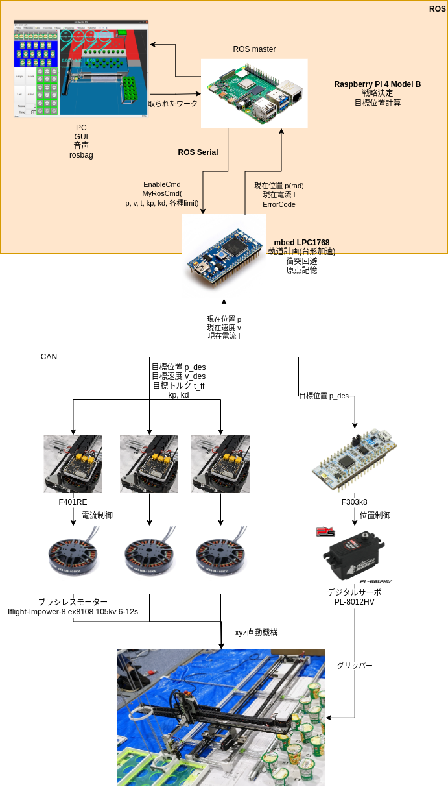
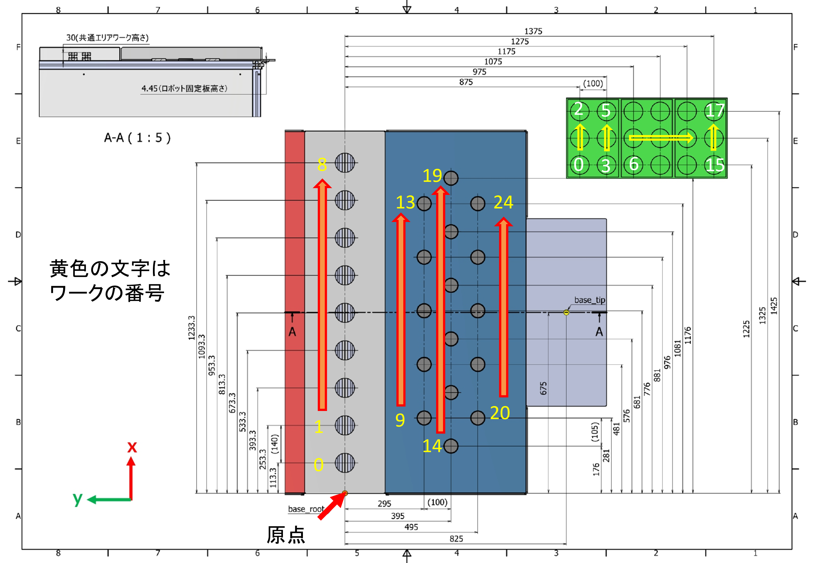

# Catchrobo 2021 ROS Package


## Environment
- ubuntu 20
- ros noetic

## Requirement
- sudo apt install ros-noetic-rosserial-mbed
- sudo apt install ros-noetic-jsk-visualization
- sudo apt-get install ros-noetic-joy
- sudo apt-get install ros-noetic-joystick-drivers
- pip install numpy pandas
- sudo apt install mpg123 


## Raspberry
[ラズパイ環境構築](./doc/raspberry_setup.md)

## GUI用PC
- gedit ~/.bashrc ###複数PCでROSを使うとき用．一台だけならlocalhostでいいが，複数台のときはmasterのIPを指定する必要がある
```
#export ROS_MASTER_URI=http://localhost:11311  # for simulation
#export ROS_IP=127.0.0.1                       # for simulation
export ROS_MASTER_URI=http://catchrobo:11311
export ROS_IP=$(hostname -I | cut -d' ' -f1)
```
- sudo gedit /etc/hosts ###ホスト名の登録．192.168....と打つ代わりにcatchroboで認識するようになる
```
192.168.xxx.xxx catchrobo
```

## mbedへの反映
https://os.mbed.com/teams/catchrobo2022/
を使用する。

1. catchrobo_sim/include/catchrobo_simをzip化する
1. ros_libを作成（catchrobo_msgを編集していなければ省略可能)
    1. rosrun rosserial_mbed make_libraries.py <コードの生成場所。どこでもいい>
    1. round関数がmbedにないので ros_lib/ros/duration.h　およびros_lib/ros/time.hのclassの中に以下の関数を追加する
        ```
        double round(double number) { return number < 0.0 ? ceil(number - 0.5): floor(number + 0.5); };
        ```
    1. ros/node_handle.hを編集し，Serial通信のバッファサイズを増やす
        ```
         int INPUT_SIZE = 1024,
         int OUTPUT_SIZE = 1024>
        ```
    1. zip化する
1. mbed compilerでプログラム名を選択し右クリック
1. インポートを選択
1. アップロードタブを選択
1. 下にあるChoose Fileから作成したzipを選択
1. ライブラリとしてインポートする(古いものがある場合には、削除してからインポートする)


## How to use
### show robot
```
roslaunch catchrobo_description catchrobo_display.launch gui:=True field:=red
roslaunch catchrobo_bringup rviz.launch
```
### simulation
```
roslaunch catchrobo_bringup sim_bringup.launch field:="blue" no_joy:="true"
roslaunch catchrobo_bringup manager.launch continue:="false" game_mode:="slow_game"
```

### 実機
- ラズパイ
```
ssh root@catchrobo
password : catchrobo
sudo chmod a+rw /dev/ttyACM0 
roslaunch catchrobo_bringup raspberry.launch field:="blue"
```
- PC
```
roslaunch catchrobo_bringup laptop.launch field:="blue"
```
- ラズパイ2(rvizの表示を待つ。nodeが立ってからtopic投げる必要があるため)
```
roslaunch catchrobo_bringup manager.launch game_mode:="slow_game" continue:="false"
```

### rosbag再生
```
roslaunch catchrobo_log rosbag_play.launch field:="blue" file:="xxx.bag"
rosservice call /rosbag_play/pause_playback "data: false" 
```

### printfしたいなら
```
sudo chmod a+rw /dev/ttyACM0 
cu -s 921600 -l /dev/ttyACM0
```

## Knowledge
### 全体構成
 
### モータードライバーシミュレーター
モータードライバーシミュレーターの位置更新は下の式で実行される。kp = 0のときは停止する.　速度入力、加速度入力はsimulatorでは考慮しない機体の動作に反映しない
```
velocity = (cmd.p_des - p)/dt
position = cmd.p_des
torque = cmd_.torque_feed_forward;
```


実機のモタドラは以下のダイナミクスで動く
```
float torque_ref = controller->kp*(controller->p_des - controller->theta_mech) + controller->t_ff + controller->kd*(controller->v_des - controller->dtheta_mech);
```

### 台形加速アルゴリズムについて
https://www.kerislab.jp/posts/2018-04-29-accel-designer4/

### ワーク、シューティングBOXの配置番号
 
[座標](./doc/234_C5_2022年度フィールド修正版0725.pdf)

### Xbeeについて
通信が安定しないため没となった．
使い方は以下の通り  
- mbedオンラインコンパイラで
ros_lib/MbedHardware.hに以下の関数を追加する
```
#ifdef USE_XBEE
:iostream(p13, p14)      //Xbee
#else
:iostream(USBTX, USBRX) //有線
#endif
```
- catchrobo_driverのserial_node_float.pyを使う. /dev/ttyUSB0のポートになると思われる